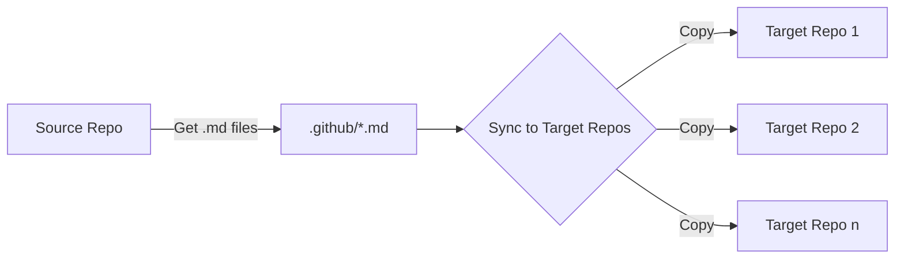

## GitHub Copilot Prompts

This repo contains my collection of GitHub Copilot prompts for my personal learning and reference. I'm making this repo public in the hope that it may be useful to others.

The way this repo is structured is by _persona_:
- `/app-dev` - contains prompts useful for application developers,
- `/test-engineer` - contains prompts useful for test engineers,
- `/infra-engineer` - contains prompts useful for infrastructure engineers,
- `/ai-engineer` - contains prompts useful for AI/ML engineers,
- and so on...

So that I can freely add prompts with minimal effort to update this readme, I will also make the file names as descriptive as possible.
Each file will have a prefix:
- `editor-` - indicates that the prompt is typed directly in the code editor (also known as GitHub Copilot code completion). In most cases, these files will have the file extension of the programming language that the prompt is for (e.g. `.js` for Javascript, `.py` for Python, etc.).
- `chat-` - indicates that the prompt is used in GitHub Copilot Chat or CMD/CTRL+I. Since these prompts are for chat, the file extensions are in `.txt`.
- `edits-` - indicates that the prompt is used in Copilot Edits.
- `sample-` - is not a prompt, but a file that other prompts might use.

> [!NOTE]
> The prompts in this repo are mostly tested using VSCode with an GitHub Copilot Individual/Business license. I will indicate if there is a prompt that requires GitHub Enterprise.

### `/copilot-instructions`
The `/copilot-instructions` folder contains sample `.md` files to be used with GitHub Copilot specific features.
1. `copilot-instructions.md` - contains a sample file to be used with [GitHub Copilot Custom Instructions](https://docs.github.com/en/copilot/customizing-copilot/adding-custom-instructions-for-github-copilot). This file should be placed in the `.github` folder of your repo.
2. `coding-guidelines.md` - contains a sample file to be used with [Github Copilot Code Review, for VS Code](https://docs.github.com/en/copilot/using-github-copilot/code-review/using-copilot-code-review). This is my VSCode JSON settings configuration:
    ```json
    {
        ...
        "github.copilot.chat.reviewSelection.instructions": [
          {
            "file": "../../../../../GitRepos/GH-Public/github-copilot-prompts/copilot-instructions/coding-guidelines.md"
          }
        ]
        ...
    }
    ```

## GitHub Actions
This repo contains an experimental github action that will push the custom prompts in `/.github/**/*.md` to a list of target repos.



> [!NOTE]
> At this time, I am assuming that direct push to the main branch is possible. If branching is required for the target repo, this experimental workflow needs to be revised.

This requires to set a GitHub Actions secret called `TARGET_REPOSITORIES`, with a JSON array of the target repositories.  For example:

```json
[
  {
    "url": "github.com/octodemo/bookstore-raffertyuy",
    "pat": "PAT_HERE"
  },
  {
    "url": "dev.azure.com/raztype/Bookstore/_git/Bookstore",
    "pat": "PAT_HERE"
  }
]
```
